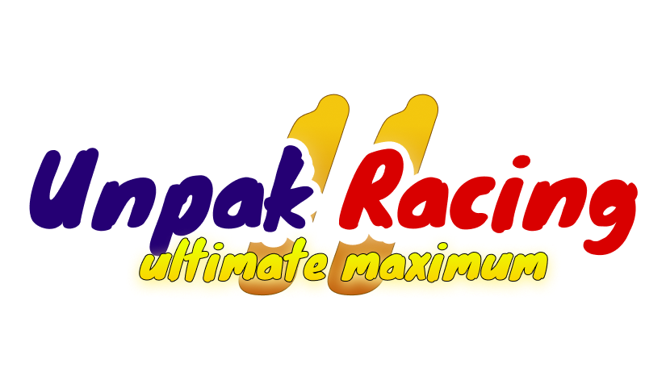
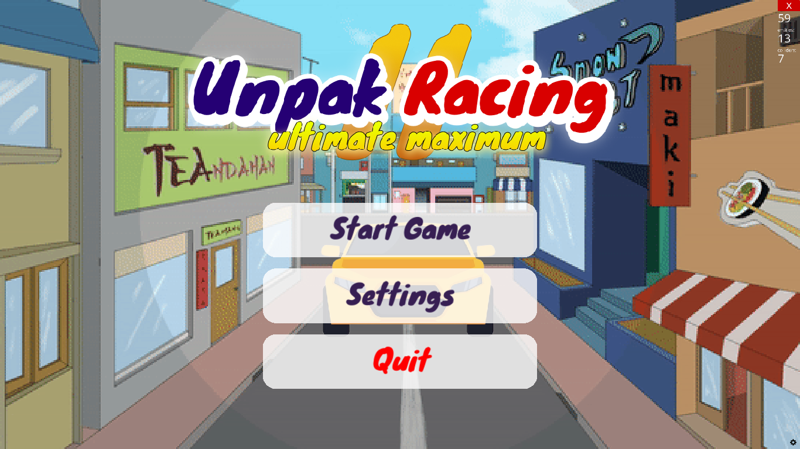
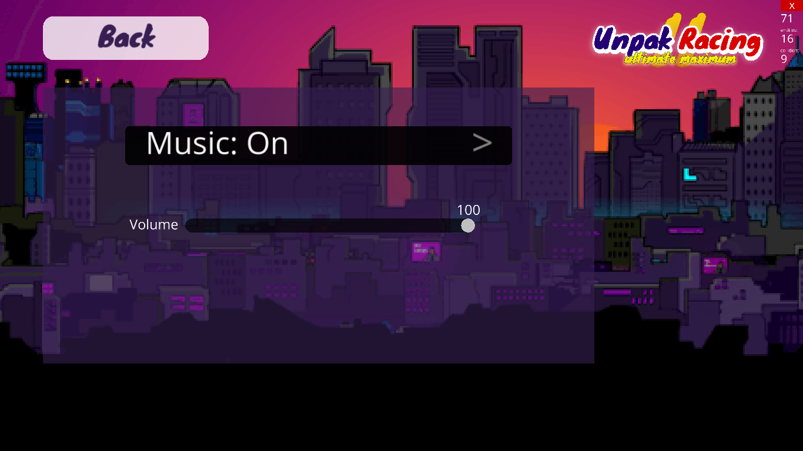
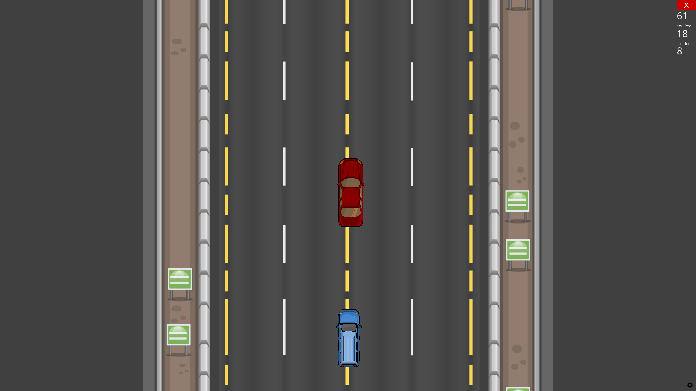

# Release Notes — Unpak Racing

<p align="center">
  
</p>

---

## v1.0.0 — Initial Release
**Release Date**: March 8, 2026
**Platform**: Windows 10/11 (64-bit)
**Build**: Standalone Executable (no Python required)

---

### ⬇️ Download

<p align="center">
  <a href="https://drive.google.com/file/d/1V-LphIXCApbXzJa5vuAHrSiZ_GB33-xu/view?usp=sharing">
    
  </a>
</p>

> 📁 **[UnpakRacing-Windows.zip](https://drive.google.com/file/d/1V-LphIXCApbXzJa5vuAHrSiZ_GB33-xu/view?usp=sharing)** — Windows 10/11 64-bit · ~150 MB · No installation required

---

### 🎉 What's New

This is the **first public release** of Unpak Racing — a fast-paced 2D endless racing game built with Python and Ursina Engine, officially branded for Universitas Pakuan (UNPAK).

---

### ✨ Features

- **Main Menu** — Start Game, Settings, and Quit buttons with custom UNPAK branding
- **Fullscreen Gameplay** — Immersive fullscreen mode on launch
- **Endless Road Scrolling** — Seamless looping road tile with no visible gaps
- **Enemy Vehicles** — Randomly spawned enemy cars with varying colors, positions, and speeds
- **Arrow Key Controls** — Responsive car movement in all directions
- **Collision Detection** — Instant game over on impact with enemy vehicle
- **Game Over Screen** — Overlay with **Play Again** and **Main Menu** options
- **Settings Menu** — UI panel with Music toggle and Volume slider (UI ready)
- **ESC to Quit** — Quick exit from anywhere in the game

---

### � Screenshots

<p align="center">
  
  <br/><em>Main Menu</em>
</p>

<p align="center">
  
  <br/><em>Gameplay</em>
</p>

<p align="center">
  
  <br/><em>Game Over Screen</em>
</p>

### �🐛 Bug Fixes & Improvements (from development)

| Issue | Fix |
|-------|-----|
| Game freezing / not responding on launch | Fixed infinite `invoke()` chain starting before gameplay; added `spawning` flag |
| Road gap visible during scroll loop | Fixed tile offset (`y=9`) and jump distance (`+18`) to match tile scale |
| Enemies keep spawning when returning to menu | `disable()` now properly clears all enemies and stops spawn chain |
| No game over on collision | Added `show_game_over()` with full overlay screen |
| Memory leak from accumulating enemy entities | Enemies destroyed and removed from list on despawn and on game over |
| Executable crash: `No graphics pipe is available!` | Fixed by copying Panda3D DLLs to root and providing `Config.prc` with correct `plugin-path` |

---

### 📦 Package Contents

```
UnpakRacing-Windows/
├── UnpakRacing.exe        ← Double-click to play
├── Config.prc             ← Panda3D graphics configuration
├── README.md              ← Full documentation
├── _internal/             ← Runtime libraries (do not delete)
├── gameplay_assets/       ← Car, enemy, road textures
└── gui_assets/            ← UI graphics, logo, and fonts
```

---

### 🚀 How to Run

1. Extract `UnpakRacing-Windows.zip`
2. Open the `UnpakRacing-Windows` folder
3. Double-click **`UnpakRacing.exe`**
4. No installation required

> ⚠️ Keep `_internal/`, `gameplay_assets/`, `gui_assets/`, and `Config.prc` in the **same directory** as `UnpakRacing.exe`

---

### 🎮 Controls

| Key | Action |
|-----|--------|
| ← → Arrow | Move Left / Right |
| ↑ ↓ Arrow | Move Up / Down |
| ESC | Quit |

---

### ⚙️ System Requirements

| Component | Minimum |
|-----------|---------|
| OS | Windows 10 64-bit |
| GPU | Any OpenGL-capable graphics card |
| RAM | 512 MB |
| Storage | 150 MB free |
| Runtime | None (standalone) |

---

### 🔮 Known Limitations

- Settings menu UI is present but audio is not yet functional
- Difficulty is fixed (no progressive speed increase)
- No score tracking in this release

---

### 🙏 Credits

- **Inspired by**: [2D Car Game Using Ursina Game Engine](https://github.com/thecrood/2D-Car-Game-Using-Ursina-Game-Engine/tree/main) by [@thecrood](https://github.com/thecrood)
- **Engine**: [Ursina Engine](https://www.ursinaengine.org/) / Panda3D
- **Font**: Knewave (OFL License)

---

*Unpak Racing — Made with ❤️ using Python & Ursina*
